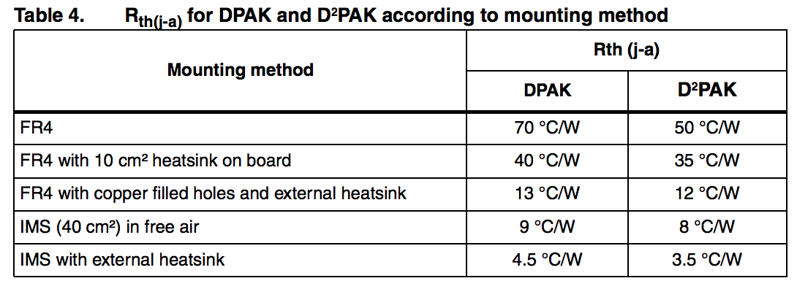
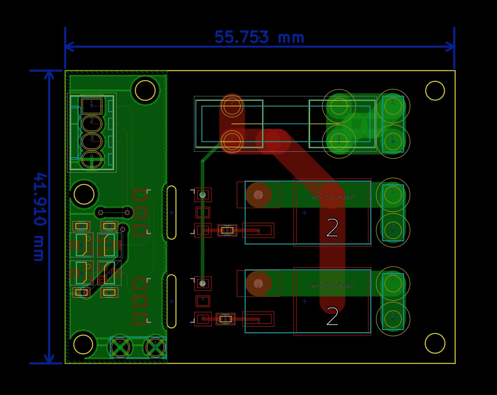
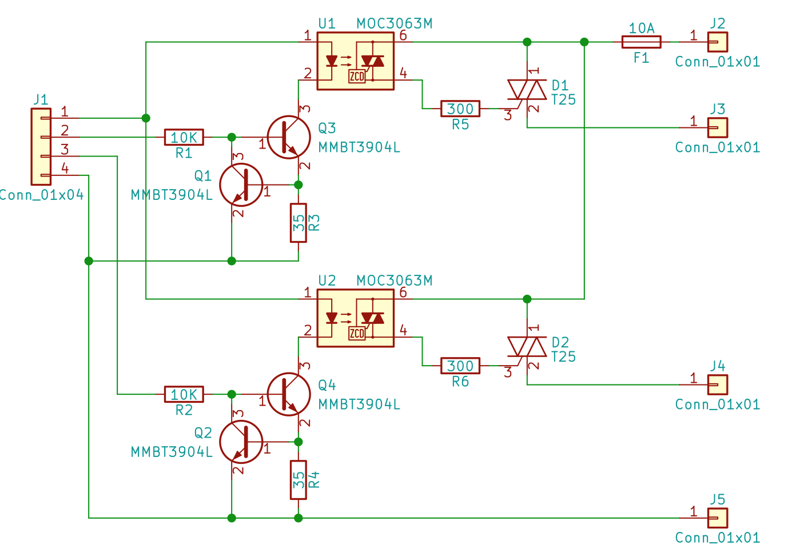
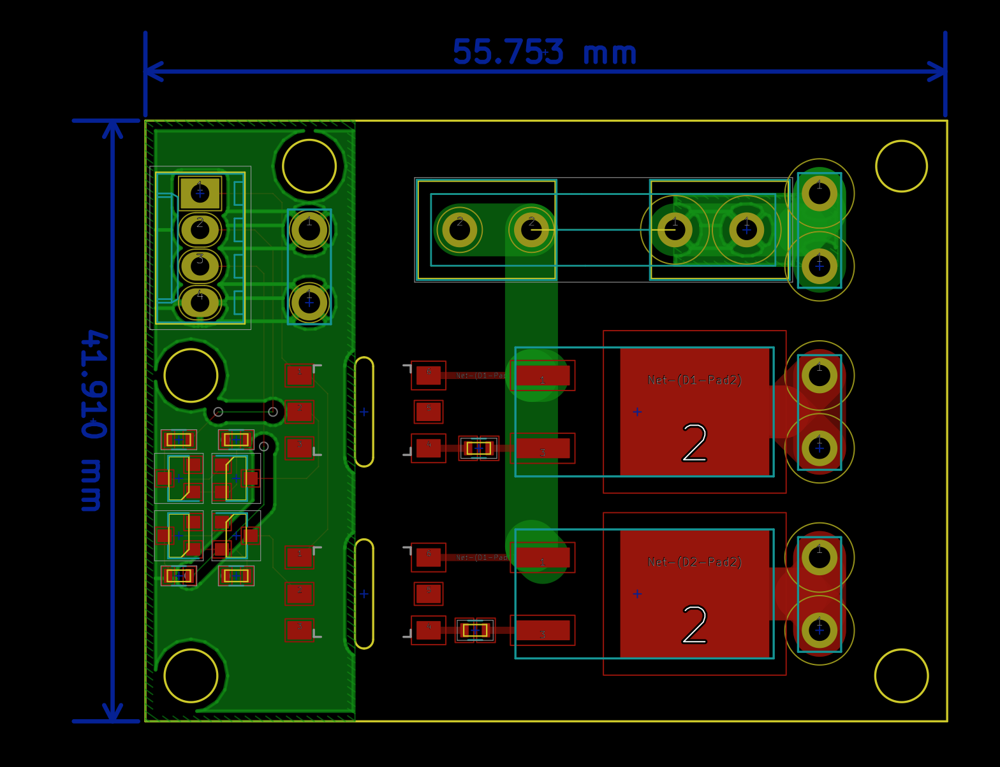
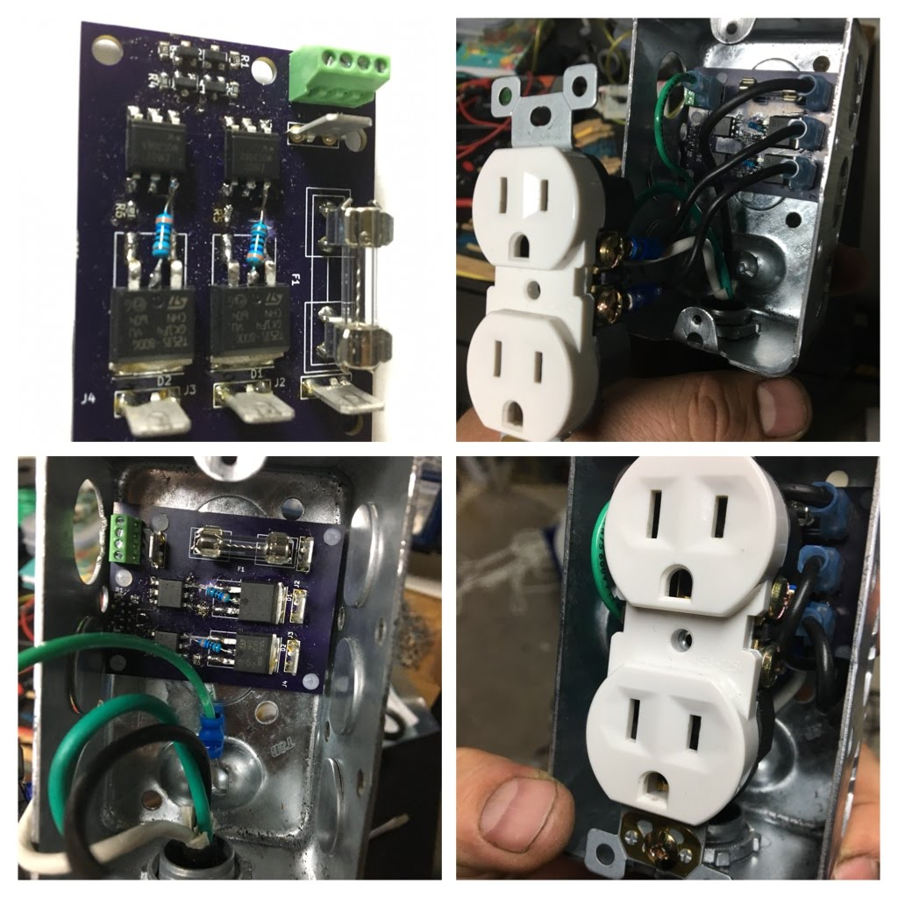

# A  solid state relay for duplex plug mains switching

I wanted to have an extension cord, with power distribution (many outlets), so like a power bar. On my desk. That I could conveniently switch on in an arbitrary way.

Here it is assembled in all of its glory

The rest of this page explains the thought process that got to this point.

Schematic and board layout were done using Kicad.

# License
[Creative Commons - Attribution - ShareAlike 3.0](LICENSE.md)

# WARNING

Disclimer. Danger. Working with mains AC power is dangerous. You can die. Your kids can die. Your pets can die. You can burn down your house. You can cause your neighbor's house to burn down when your house is burning down.

You have to know how to be safe.
* Never connect live AC mains to something without having all the conductors insulated.
* Be aware of the current carrying capacity of the components and wires you are using. Things fail badly when there is high voltages involved and you exceed the rated voltages. e.g. capacitors explode.
* Be aware of the thermal considerations of the compon you are using. Things that pass current will dissipate heat as they are in operation. When things get too hot, they burn. when they burn they cause other things to burn too.
* Always test AC switching things using a low voltage AC source, such as a transformer, or an isolation transformer where the current can be controlled before trying to plug your stuff in for the first time. short circuits can cause unexpected current or loading and this can cause things to explode or you can get a nasty shock, including, but not limited to death.

There are a lot of good articles and discussion on the Internet. Read up. Know what you need to do to be safe

Doing anything I do here is something you are doing at your own risk.

I am actively telling you to not do anything I am doing here.

# Background
For many years I have always assembled my own power distribution devices.

This goes back to 1990's era of computing where most peripheral devices had their own Class 2 plug in wall transformer (AKA brick) and the bulk of these things would cover several slots on the typical K-Mart power bar strips. So then you need to buy three power strips and chain them all together. And this is worse, both electrically and aesthetically.

Now I guess there are less peripherals that need big dumb bulky bricks. But I sort of appreciate the extra features I can achieve by having a customizable power strip. Like this most recent one I use on my workbench.

Some plugs have the half a plug, half a switch. So I can conveniently switch the thing off instead of having to (un)plug it every time. This is also useful for stopping phantom power loss, like the computer power brick when I am not at home.

The downside is lately I have more small desk appliances I want to have plugged in. Lamps. Solder stations. I would have enough plugs if it was not for half of my plugs being taken up by switches. And of course when your desk is a littered mess of several in progress project ideas you will never get around to finishing, it is somewhat inconvenient to have to reach over all this mess and find the right switch.  Of course it would be neat to have some other means to just control these plugs.  Like a system tray widget on my computer, a simple USB to GPIO device to control the switching of the plugs.

Of course it is awesome to build something that is "internet of things". Make a fun app to control a plug from anywhere in the world!.  Apps!! I could build a small wifi or bluetooth receiver into the plug box and have an elegant wireless control too.

Well, this is not quite there yet. I thought I would start with building just the switching part of things. Which technically is just a solid state relay. And to use regular wires to control it. Then then I can work on building integrations or wireless signalling, or apps, or even just a panel with legacy push buttons.

# Next steps

* I would like some feedback for how this is constructed. Is there anything I can do better?

* Measure the performance. How hot does the triac get under what AC load.

* Create a board with the updates and feedback.

* I would like to get my circuit board CSA approved, or UL certified. So then it could be used in like my office without causing anyone undue concern.

* Design a 3.3v power supply, or use an existing module thta does this, so I can stuff small wireless or bluetooth micro controller into the plug. maybe a separate circuit board for this. Though I kind of like the idea of "just a plug control", it would be more practical in a general use to have these around a house and not just on my workbench.

# Theory
I really did not consider using mechanical relays because of their bulky size. I wanted something that could fit into a regular metal plug box.  There are a lot of [relay modules](https://www.cytron.io/p-bb-relay-5v-02), [shields](https://www.seeedstudio.com/Relay-shield-V2.0-p-1376.html).

Though this feels somewhat incomplete.
* There is no fuse.
* The low voltage connections is just breadboard jumper style header pins. Not a very robust connector.
* It needs 5V, but I want to use 3.3v.
* You need to drive an active low signal to control the relay.
* The Arduino shield is down right dangerous for 120V use, being directly on top of the Arduino like that.
* Physically these are too large to fit inside a regular metal plug box.

I am sure these are good for some things, lower voltage switching like for a HVAC thermostat. Or applictions where you really want a normally closed feature. Or for setting up some experiements to demonstrate or learn like for a lab or classroom setup.

They just didn't feel like a good fit for what I wanted to do here.

Really it is more elegant to use Triac device with an opto isolator. This is the same feature and behavior as a solid state relay. Ok. fine. Just get a couple nice solid state relays. Done. Nothing to see or do here.

Well. Its just that a regular solid state relay is [quite expensive](https://www.digikey.ca/product-detail/en/sensata-crydom/PF240D25/CC1341-ND/278899).  And the dual solid state relays are even [more expensive](https://www.digikey.ca/product-detail/en/sensata-crydom/UPD2415D-10/CC2483-ND/2177128). Although. Just having to design a PCB that makes use of these already RU certified parts. Someone has done the work to try to compute the current and thermal carrying abilities (see below). It is a compelling reason to just buy vs build. A [popular youtuber](http://www.instructables.com/id/Make-Your-Own-Solid-State-Relay/) also agrees that in this case it is really better to buy a solid state relay instead of trying to build your own. Like I am doing here. So maybe just look into finding one we can buy.

Oh.. You are still reading this. Ok. Onward.

I did find some other projects for an [Arduino Triac Shield](https://forum.arduino.cc/index.php?topic=24335.0). But that looks horribly dangerous again with the high voltage there mixed up and exposed with the low voltage stuff. And again with the too large to fit into a metal plug box.
There was a later version with the separate board, but again this only has 1 triac.

I took a few minutes to read up on what kinds of Triacs are out there, and found I like these [STMicroelectronics Snubberless series Triacs](http://www.st.com/content/ccc/resource/technical/document/application_note/ca/ef/9d/1e/4a/9f/47/69/CD00003865.pdf/files/CD00003865.pdf/jcr:content/translations/en.CD00003865.pdf).

* These devices are readily available on [Digikey](https://www.digikey.ca/product-detail/en/stmicroelectronics/T2535-800G-TR/497-10581-1-ND/2294945
)
* They are rated for 25A. With peak surge of 260A for 16 ms (e.g. inrush current)
* Rated for repetitive peak off-state voltage of 800V.

So this should be safe for how we plan to use it.  The next thing to consider is how hot this will get when operating.

* Tj = 125 °C (Operating junction temperature)
* Rth(j-c) is 0.8 °C/W
* Rth(j-a) is 45°C/W.

Their [thermal management for handling and mounting](http://www.st.com/content/ccc/resource/technical/document/application_note/42/4a/77/9a/f5/58/43/77/CD00004000.pdf/files/CD00004000.pdf/jcr:content/translations/en.CD00004000.pdf) document recommends for the D2PAK packaging using a FR4 board with copper heat spreader area, and filled copper thru holes, or an additional heatsink.

The data sheet recommends only currents up to 8A for a good FR4 board design. Since I don't have the filled copper thru holes, I would say the actual current I can safely support with my board is  going to be much less.

Trying to think about this, for room temperature use

* Ta = 20 °C
* Tj = 125 °C
* Rth(j-a) = 50 °C/W

With the junction temperature modelled as `Tj = Ta + (P * Rth(j-a))`

Then `P = (Tj - Ta) / Rth(j-a)`

Or, with no heat sink, P = 2.1W . That feels wrong to me. But then further [reading](http://www.farnell.com/datasheets/1760777.pdf), yes it is regular to expect 2W heat dissipation for surface mount triacs.

Remember too, that thermal requirements for the triac will be the power loss inside the triac, not the power to the AC load device.  From the datasheet the peak on-state voltage drop, VTM, is the voltage across the device while it is on-state. It is specified at the peak current corresponding to the IT(RMS) current of the device. This voltage to determine the power dissipated by the triac.

So for these triac devices,

* VTM = 1.55 V

So then, if we want to keep power dissipation down to 2 W, the max current we can pass is about 1.3 A. Or about 150 watts.

The recommended approach for surface mount components is to use Insulated Metallic Substrate (IMS). IMS offers enhanced thermal characteristics as is a substrate consisting of three different layers:
* base material which is available as an aluminum or a copper plate
* thermal conductive dielectric layer
* copper foil, which can be etched as a circuit layer.

Using an IMS board should reduce the Rth(j-a) from 50 °C/W to 8 °C/W.  Which should then allow the triac to dissipate 13 W of power, or about 8 A

This is not something I have access to at OSHPark. This other place [Twisted Traces](https://www.twistedtraces.com/products/prototype-panel/ims-insulated-metal-substrate-pcb) appears to support IMS boards. We have to order a single panel, that goes for $320 USD, which for this board size will be about 26 boards or cost to about $12 per board. But this will allow us to handle up towards 900 W loads.

So it is becoming clear to me now why actual solid state relays are so large. They are mostly heat sinks and electrical isolation.

Another [data sheet](https://www.farnell.com/datasheets/1760767.pdf) sais "Please note that the actual thermal resistance will be reduced by other, non-dissipating components in close proximity to the triac, while it will be increased by any components that dissipate power in the presence of the triac. It is essential therefore to measure the prototype to discover the true thermal performance."

Having to also consider there are two triacs near each other. So this will influence their heat dissipation abilities right.

So I need to apply some test loads to the device and see how hot it gets and how fast.  I will need  thermal sensor (those tools that use the infrared light to measure temperature) and a load device.  I do not have a good electrical load testing tool either. All i have is a heat gun, which has low (~5A) and hight (~9.5A) current draw.

# Assembly
This is definitely one of those things where it requires a lot more effort and consideration to take a project from just an idea idea to a something that is "finished" product. Or at least, something that is safe to use and actually useful.

This is the kind of stuff I didn't get to learn in school. Maybe I didn't take the right courses. But in any case some stuff was not obvious to me until I tried it. In some cases I did not even know what I needed to do. It took me a few tries to get it right. Sometimes there were failures. I figured I would chronicle the revisions here, as some of the things that came up were not obvious to me. So they might be a good learning tool for others.

# V1.1
Small improvements on the v1.0 build:

* The connection of the opto triac to the A1 and G pins of the T25 was wrong. Updated footprint, schematic, and new board layout to fix this.

* The fuse holder footprint was differnt from the fuse holder clips I had ordered. The same family. Just curiously rotated 90°. I worked around it by ordering some more fuse holder clips. But really this was another footprint selection bug. Now using the footprint for the fuse holders I have.  The ones that are in use now are slightly lower profile, so the fuse is held closer to the board, leaving the slightly more room in the box for the plug.

* The resistor from opto triac could be larger. Reading the datasheet, using 300 ohm is well within the current capabilities of both the MOC3063M and the T25. But It is perhaps more current than is required.  When patching the V1.0 board with a thru hole resistor I found we can use up to about 1K total resistance.

* Relocated the ground terminal connection to bottom of the low voltage side. It was near the terminal block and in the way if we wanted to use [MTA-100 series](https://www.digikey.ca/products/en?FV=ffec1142) connectors for internal wiring.

* Using OSHPark 2 oz copper service http://docs.oshpark.com/services/two-layer-hhdc/. It is better suited for current capacity.

# V1.0

So with the idea in mind and much reading of the datasheets and internet posts, set off to design. The triac application note demonstrates how they could be used as a solid state state relay, by fronting them ith an opto isolator with zero crossing detection and triac output.

We have a connector there for AC ground to be also our ground.

This is actually two swiches. The idea being that in a standard duplex plug there are two halves (top and bottom). So that we can provide individual switching to each half. Which will allow us to plug two lights into a single duplex plug.

The inputs to the opto isolator is a constant current source provided by the two NPN transistors. Q1 is activated when there is enough current flowing through R3 to provide a voltage drop of the about 0.6V to cause Q1 to turn on, which works to turn off Q3. This allows us to have a wide range of input voltage (2 to aobut 30V) but without having to worry about using a current limiting resistor that will just dissipate the extra voltage as heat.  I like the idea of my electrical things not getting too hot of course. Probably it will be just used for 3.3V to 5V from a microcontroller.

The board can be laid out small enough to fit inside a metal duplex outlet style box. So that we can provide control wires into the box.

I was invisioning an extension cord with the metal plug box on the end with this controller board inside the metal box.

This keeps all of the 120V AC inside the extension cord and outlet box. We do not need to have 120V wires going out of the box to our circuit board. Which is a good thing here, since we are working with both water and electricity.

So to use this we will just need 2 digital IO pins from the Pi.

In this case, It was challenging for me to breadboard this, because the pieces are all surface mount. And I have reservations about using 120V AC on a solderless breadboard. I would never do this.

Instead I had some circuit boards built using OSHPark and then assembled some the pieces.

This first version I managed to mix up the A1 and A2 pin outs for the triac

I believe the issue was I chose the standard footprint for "a triac" with the pin out A,A,G. But maybe this D2PAK type package has a different pin numbering than the TO-220 type case?   So I updated the schematic and board layout for next time.

It turns out this is super important. We basically require a voltage across the A2 and G. not the A1 and G as I have it (the images in this document are still wrong. The kicad project is updated).

So fixing the circuit board with some bodge resistors and cutting the trace they work now. Remember. this is a prototype.  I also tested this using a 120V to 12VAC transformer, and test lit up an old automotive headlamp I had in a junk bin. Before graduating to try to test switch AC mains things.

Note there is a cut out under those opto isolators, so as to improve the isolation between the low voltage and high voltage side. I also have the metal box ground connecting to the ground plane on the low voltage side. There is no ground plan on the AC side.  Just the wide traces and the pad for the triacs which goes directly to these terminal connectors.

With the board ready to go and, its time to assemble into the metal plug box.

The plug itself has that metal bridge bar between the top and bottom outlets cut. So that they may be powered individuall.

I use the nice crimp and spade connectors, as according to electrical code, we can't be soldering these wires, the risk of mechanical separation and high resistance of the solder joint causing a fire. I didn't have to, but also used fork terminals on the wires for the screw to the plug. Just makes for a nicer wiring job, and now there are no possibility of stray wires coming out from under the screw terminals.

According to electrical code, low voltage wires can not exist within the same box, conduict, or package as high voltage wires. With the exception if you are making an all in one powered plug in wireless access point.

The only wires inside this box are the 14 gauge AC wires.

The low voltage side of things was designed to be on the neutral side of the plug. The hot side of the plug being on the side where the wire and terminal connectors are.

The board is mounted inside the metal plug box by drilling some holes into the metal box. And using 1/4 inch hex aluminum stand offs. I think I placed the holes far enough away from the AC points on the circuit board to be OK. though I covered the solder side (the side that is facing down towards the metal box) with some electrical tape just in case.  I use nylon screws into the metal standoffs so its less metal surface on the top of the circuit board. They seem to be able to get a good snug fit and have that feeling they won't come loose on their own.

Here I do not have a physical baffle between the low voltage and high voltage side. Though the precautions I took above are likely ok for my use for now.

The only thing I do not like about this is the need to have an actual wire wired up to the box. I would prefer to have some kind of connector. I was thinking RJ-11 because this control cable is old flat phone wire I had on hand.

The boards OSHPark offers are 1 oz (1.4mil) FR4 boards that are 1.4mm thick http://docs.oshpark.com/services/two-layer/ These are not the best for thermal conductuctivity.   I should really have used their 2 oz product http://docs.oshpark.com/services/two-layer-hhdc/

This board was designed following the footprint layout, but not doing the maths for the thermal requirements for the triacs first. After crunching the numbers these devices in their configuration are good for up to about 2W of power dissipation. Which is 150 watts of load per device. Which is of course good enough for LED desk lamps, soldering stations, glue guns, oscilliscope, usb charger bricks, TV, small computing appliances. But not so much for heat guns, spot welders. Though these are intermediate use.  Again, more testing will help us to see.

To be able to get the triacs to handle more power, they need better heatsinks.

There are these little [clip on heatsinks](https://www.digikey.ca/product-detail/en/wakefield-vette/217-36CTE6/345-1099-ND/1033769) for these TO-263 package. Maybe should see how these help too.
 They have a thermal resistance of 55.00 °C/W . So this will improve the heat dissipation abilities of the triac, allowing it to handle more power. But how much more?  Stupid maths and formulas.Not sure how to work this.  Maybe I'll just try them. But need to borrow a temperature sensor first.